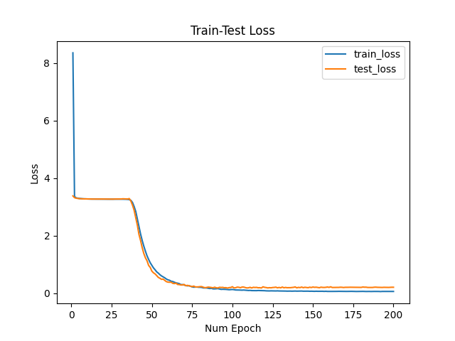

# Captcha_Recognition
Pytorch: Captcha recognition using convolutional RNNs 
#### Dataset:
 Captcha Images can be found here
[[Link](https://github.com/AakashKumarNain/CaptchaCracker/blob/master/captcha_images_v2.zip)]

Number of Images - 1040

Unique characters in Captcha - 19

## Experiments
Shared parameters:
```
batch size: 8
Image dimensions (HxW): 75x300
Num Conv Layers: 2
num GRU layers: 1 (Bi-directional)
initial learning rate: 3e-4
learning rate scheduler: ReduceLROnPlateau
epochs: 200
```

**Dataset-split**: 10% for Validation
### Experiment 1

|                | **Loss** |
|----------------|----------------|
| Training set |        0.06  |
| Evaluation set |        0.20  |

####Accuracy on Eval Set: 76.92%

